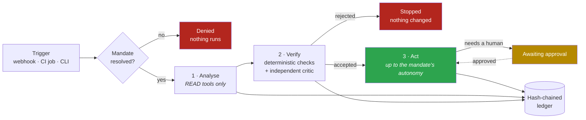

<div align="center">

# 🛡️ Regent

**Governed AI agents for DevOps automation — every action under an explicit mandate.**

*An AI that reviews pull requests, triages failed builds, fixes insecure infrastructure and
drafts incident updates — and can prove, line by line, what it saw, what it decided,
what it did, and who allowed it.*

[](https://github.com/FlorianMartins/regent/actions/workflows/ci.yml)
[](https://github.com/FlorianMartins/regent/actions/workflows/codeql.yml)
[](https://scorecard.dev/viewer/?uri=github.com/FlorianMartins/regent)
[](https://github.com/FlorianMartins/regent/attestations)
[](https://florianmartins.github.io/regent/)
[](https://www.python.org)
[](https://mypy-lang.org/)
[](LICENSE)

</div>

---

## In plain words

Imagine a new team member who never sleeps, reads every pull request, watches every
build and every alert. You would not give that person the production credentials on day
one. You would give them a **mandate**: *you may comment, you may not merge; you may re-run
a flaky job, you may not delete anything; you may spend this much; here is what needs my
signature.* And you would want a **logbook** of everything they did.

Regent is that mandate and that logbook, for AI agents. The agents are useful because they
are bounded, not in spite of it.

## What it does

| Agent | Trigger | What it does | How far it may go |
|---|---|---|---|
| **pr-reviewer** | pull request opened | Line-anchored findings (security, correctness, reliability), posted as a review | Advise — never approves, never blocks |
| **ci-triage** | workflow failed | Classifies the failure from the logs (flaky / infra / code / config), opens an issue or re-runs | Re-run once, only with evidence of flakiness |
| **iac-guardian** | Terraform / Dockerfile change | Runs [CloudGuard-IaC](https://github.com/FlorianMartins/cloudguard-iac), proposes the minimal fix, **re-scans to prove it**, opens a *draft* PR | Propose — a human merges |
| **incident-triage** | alert firing | Correlates the alert with recent deploys and metrics, ranks hypotheses, drafts the status update | Advise — a rollback is a recommendation |
| **dependency-steward** | bot PR opened | Merges routine patch/minor bumps under policy, escalates the rest | Merge only where a repository explicitly allows it |
| **release-scribe** | tag created | Release notes from conventional commits, as a *draft* release | Propose |

Every agent runs the same three phases. Nothing skips a phase.



## See it in 60 seconds

No API key, no network, no cloud account: the model's answers are recorded, everything
else (the scanner, the policy engine, the verifier, the ledger) is real.

```bash
git clone https://github.com/FlorianMartins/regent.git && cd regent
python3 -m venv .venv && source .venv/bin/activate
pip install -e ".[dev]"
examples/demo/run.sh
```

```console
▶ 1/3  CloudGuard-IaC on the vulnerable module (expected: findings)
  21  CRITICAL  CG_IAC_001  aws_s3_bucket.uploads       bucket ACL is "public-read"
  28  CRITICAL  CG_IAC_005  aws_security_group.bastion  ingress from 0.0.0.0/0 reaches 22/SSH
  …  Summary  2 critical   2 high   1 medium   1 low

▶ 2/3  regent run iac-guardian  (provider: replay, dry run)
status   succeeded
mandate  L2_PROPOSE · tier deep · verification required
usage    2 llm call(s), 5 tool call(s), 6400+1020 tokens, $0.1500
verifier accepted · issues: 0
actions  {"pull_request": {"dry_run": true, "method": "POST", "path": "/repos/acme/demo/pulls", …

▶ 3/3  CloudGuard-IaC on the fixed module (expected: clean)
  Summary  1 low                                  ✅ PASSED

▶ Audit trail — every decision is in the hash-chained ledger
✓ 15 event(s), chain intact
```

The same run against a real repository, with a real model:

```bash
export ANTHROPIC_API_KEY=…  GITHUB_TOKEN=…
regent run iac-guardian --repo acme/infra --payload '{"paths": ["terraform/"], "head": "regent/fix", "base": "main"}'
regent run pr-reviewer   --repo acme/api   --payload '{"number": 42}'
regent ledger verify
```

## How governance works

A **mandate** is a YAML document, reviewed like code (CODEOWNERS: platform + security).
It is the only way to widen what an agent may do. Code cannot.

```yaml
- agent: ci-triage
  autonomy: L3_ACT_REVERSIBLE          # may re-run a job; may not merge, deploy or delete
  allowed_tools: [github.get_workflow_run, github.get_job_logs, github.comment,
                  github.create_issue, github.rerun_failed_jobs]   # allow-list, never a deny-list
  requires_approval: []                # nothing here needs a signature…
  max_remote_class: CONFIDENTIAL       # …but nothing RESTRICTED leaves for a remote model
  verification: required               # an independent critic must accept the output first
  budget: { max_llm_calls: 4, max_usd: 1.0, max_duration_s: 600 }
```

| Autonomy | The agent may… | Tools it unlocks |
|---|---|---|
| `L0_OBSERVE` | read and report | `READ` |
| `L1_ADVISE` | comment, label, open issues | `ADVISE` |
| `L2_PROPOSE` | open draft PRs, write in its workspace | `PROPOSE` |
| `L3_ACT_REVERSIBLE` | re-run, merge (revertable), roll back | `ACT_REVERSIBLE` |
| `L4_ACT` | irreversible changes | **never granted** — `regent policy-check` refuses it |

Guard rails that hold whatever the model says:

- **Phase gate** — during analysis only `READ` tools exist; an agent that tries to write while it thinks is denied and the run stops.
- **Independent critic** — a second model call, different prompt, whose only job is to reject; plus deterministic checks (the IaC fix must scan clean, a review finding must cite a line that is in the diff, a re-run needs a flaky category…).
- **Redaction and classification** — credentials never reach a provider; content above the mandate's confidentiality ceiling routes to a local model or is refused.
- **Budgets** — tokens, dollars, calls and wall-clock per run, enforced by the gateway.
- **Untrusted data channel** — diffs, logs, tickets and alerts are wrapped as data the prompts are told to never obey (lesson from the [LLM Security Lab](https://github.com/FlorianMartins/hivey-llm-security-lab), OWASP LLM01/LLM08).
- **Kill switch** — one line in a mandate file disables an agent everywhere.
- **Ledger** — append-only JSON Lines, each event hashed with the previous one; `regent ledger verify` detects any edit, removal or reordering.

## LLMOps, not just LLM calls

- **Prompts are code** — `regent/prompts/*.md`, versioned in front-matter, addressed as `pr_reviewer@1`; the ledger records the id *and* the SHA-256 of what ran.
- **Skills are code** — reusable organisation know-how (`secure-review`, `terraform-baseline`, `incident-communication`…) that agents load; changing a rule is a pull request.
- **Evals are tests** — `evals/cases/*.yaml` replay recorded model answers against a fake world and assert on outputs, actions and forbidden actions; they run offline in CI, and live nightly against the real model. A prompt change ships with an eval or it does not ship.
- **Model tiers, not model names** — mandates say `fast` / `balanced` / `deep`; the router maps to Claude Haiku 4.5 / Sonnet 5 / Opus 5 today, and degrades when a budget runs thin.
- **Observability** — Prometheus metrics (`regent_runs_total`, `regent_llm_usd_total`, `regent_tool_calls_total{decision}`, `regent_verifications_total`…), OpenTelemetry spans per run, LLM call and tool call, a Grafana dashboard in `infra/compose`.

## Certifications and attestations

Every release is meant to be verifiable by a stranger, not trusted on the author's word:

| Evidence | Produced by | Verify with |
|---|---|---|
| Build provenance (SLSA) | `actions/attest-build-provenance` on the wheel and the image | `gh attestation verify oci://ghcr.io/florianmartins/regent:vX.Y.Z --owner FlorianMartins` |
| Image signature | cosign keyless (Sigstore, GitHub OIDC identity) | `cosign verify ghcr.io/florianmartins/regent:vX.Y.Z --certificate-identity-regexp …` |
| SBOM (SPDX) | Syft, attached to the release and attested | download from the release, or `gh attestation verify --predicate-type https://spdx.dev/Document` |
| Vulnerability scan | Trivy on every image, fails on HIGH/CRITICAL | CI job `container` |
| IaC and Dockerfile | CloudGuard-IaC on `infra/` and the `Dockerfile` | CI job `iac-security` |
| Admission policies | Conftest / OPA on rendered manifests, Terraform and mandates | CI job `iac-security` |
| Secrets | gitleaks | CI job `secrets` |
| Code | ruff · mypy strict · bandit · pip-audit · Semgrep · CodeQL · 117 tests · evals | CI jobs `quality`, `test`, `sast`, `evals` |
| Project hygiene | OpenSSF Scorecard (branch protection, pinned deps, token permissions…) | badge above |

`scripts/verify_release.sh vX.Y.Z` runs the verification commands for you. What these do *not*
prove is written down too: [docs/12-certifications-and-attestations.md](docs/12-certifications-and-attestations.md).

## Repository map

```
regent/            the platform
  core/            mandates, policy engine, budget meter, hash-chained ledger, redaction
  gateway/         the single door to LLM providers: routing, caching, classification, audit
  runtime/         analyse → verify → act, phase gate, approvals
  agents/          the six agents + the verifier
  tools/           GitHub, CloudGuard-IaC, sandboxed commands, workspace, Prometheus
  prompts/         versioned prompt templates      skills/library/   versioned skills
  api/             FastAPI control plane (webhooks, runs, approvals, /metrics)
  cli/             `regent` command                evals/            eval runner
policies/mandates/ who may do what                 policies/rego/    OPA admission policies
evals/cases/       recorded eval cases             examples/demo/    the 60-second demo
infra/             docker compose · Kustomize + Argo CD · Terraform (AWS)
docs/              the documentation site (mkdocs)  ·  ADRs  ·  runbooks  ·  French presentation
```

## Quick start

```bash
pip install "regent-platform[api] @ git+https://github.com/FlorianMartins/regent@main"
regent agents                       # the catalogue
regent mandates                     # who may do what
regent policy-check                 # invariants no mandate may break
regent evals                        # the offline eval suite
regent serve                        # control plane on :8080 (webhooks, runs, approvals, metrics)
docker compose -f infra/compose/docker-compose.yml up   # + Prometheus, Grafana, OTel collector
```

Configuration is environment only (`.env.example` lists every variable): `REGENT_PROVIDER`
(`anthropic` | `local` | `replay`), `REGENT_LOCAL_URL` for a vLLM/Ollama endpoint that keeps
confidential data inside the network, `REGENT_MANDATES_DIR`, `REGENT_LEDGER`, `GITHUB_TOKEN`,
`GITHUB_WEBHOOK_SECRET`, `ANTHROPIC_API_KEY`.

## Documentation

The site: **https://florianmartins.github.io/regent/** — built from [`docs/`](docs/).
Every page opens with a plain-words explanation, then the precise design and the reasons.

- [Guided tour](docs/00-guided-tour.md) — follow one pull request through every guard rail
- [Architecture](docs/02-architecture.md) · [Agent catalogue](docs/03-agent-catalogue.md) · [Workflows](docs/04-workflows.md)
- [Governance and autonomy](docs/05-governance-and-autonomy.md) · [Security](docs/06-security.md) · [Observability and evals](docs/07-observability-and-evals.md) · [FinOps](docs/08-finops.md)
- [Platform and delivery](docs/09-platform-and-delivery.md) · [Operating model](docs/10-operating-model.md) · [Technology radar](docs/11-technology-radar.md)
- [Architecture decision records](docs/adr/) · [Runbooks](docs/runbooks/) · [Glossary](docs/glossary.md)
- 🇫🇷 [Dossier de présentation](docs/PRESENTATION.fr.md)

## Honest limits and roadmap

- Approvals are implemented by **re-running with pre-approved tools** (agents are idempotent up to their first write), not by suspending a process; durable execution (Temporal) is the phase-3 design ([ADR-0010](docs/adr/ADR-0010-approvals-by-rerun.md)).
- The run store is in memory; Postgres is specified, not shipped ([ADR-0009](docs/adr/ADR-0009-run-store.md)).
- Sandboxed commands are allow-listed subprocesses; ephemeral gVisor/Kata job pods are the production target ([docs/06-security.md](docs/06-security.md)).
- Live evals need an API key and a budget; the CI runs the offline suite on every change and the live one nightly when a key is present.

## Built on

- [CloudGuard-IaC](https://github.com/FlorianMartins/cloudguard-iac) — the shift-left scanner that is both a tool of the IaC guardian and the ground truth it is verified against.
- [LLM Security Lab](https://github.com/FlorianMartins/hivey-llm-security-lab) — the OWASP LLM Top 10 red-team lab whose lessons shaped the gateway (untrusted-data channel, redaction, bounded agency).

## License

MIT — see [LICENSE](LICENSE).
