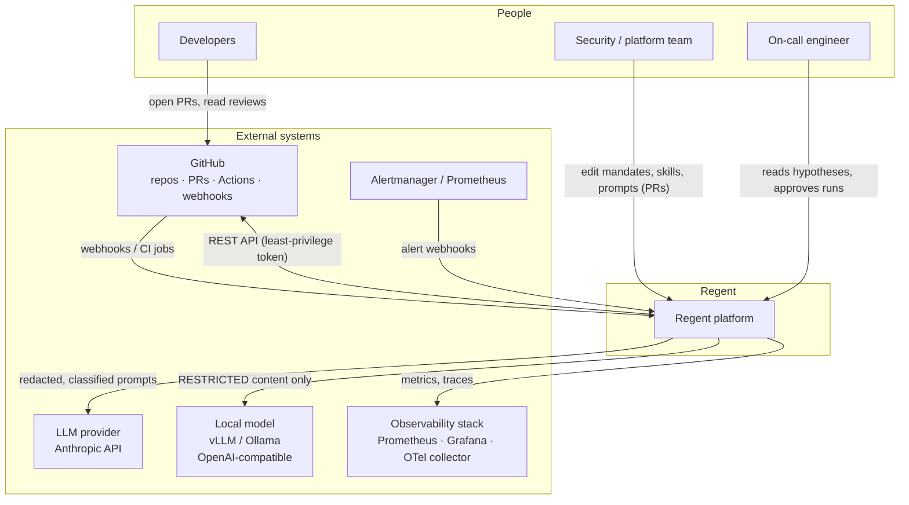
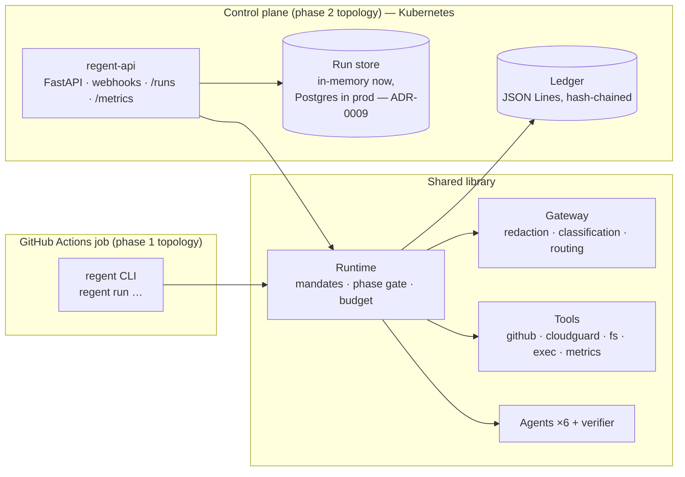
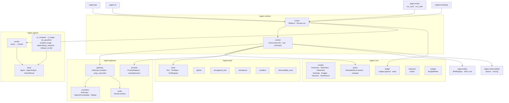
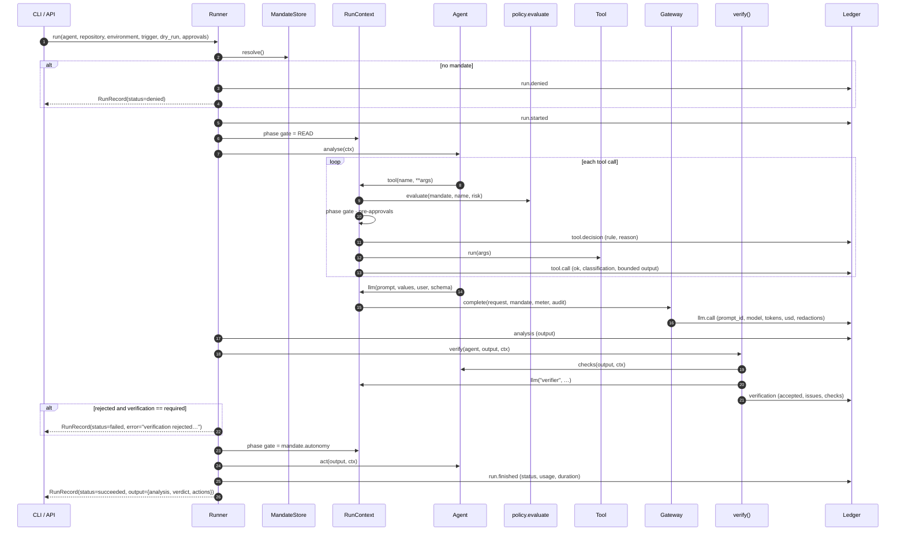
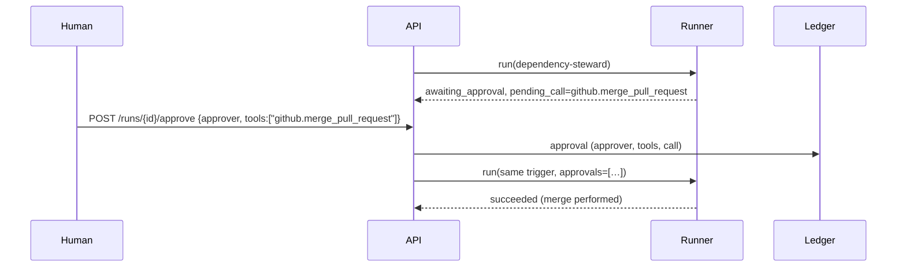
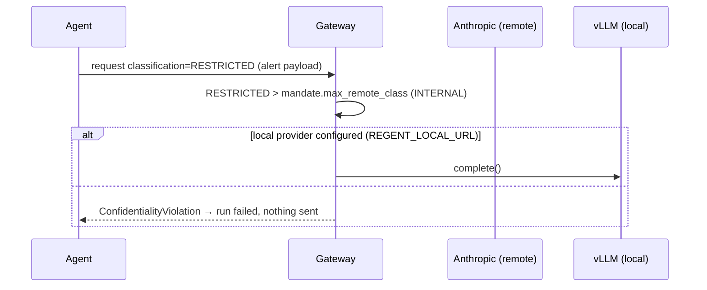

# Architecture

!!! tip "In plain words"
    Regent is a small, deliberately boring machine. Events come in (a pull request, a failed build, an alert). A rulebook says which agent may handle each event and what it is allowed to do. The agent reads through tools, thinks through one guarded door to the language model, has its conclusion checked, and only then acts through tools again. Everything it did is written to a ledger. This page shows the boxes and the arrows, then each module of the code.

## Context (C4 level 1)



## Containers (C4 level 2)



Both containers use the same library and the same bootstrap (`regent/bootstrap.py`), so a setting cannot be right in one and wrong in the other (see [ADR-0014](adr/ADR-0014-pipeline-embedded-first.md)).

### Topology 1 — pipeline-embedded (ship first)

The agent runs *inside* a CI job, with the job's own identity (`GITHUB_TOKEN` scoped by the workflow's `permissions:`), on the runner's checkout as its workspace. No long-running service, no webhook endpoint, no new network exposure. The ledger is uploaded as a build artefact.

```yaml
# excerpt of a consumer workflow
- run: regent run pr-reviewer --repo "$GITHUB_REPOSITORY" --payload "{\"number\": ${{ github.event.number }}}"
  env:
    ANTHROPIC_API_KEY: ${{ secrets.ANTHROPIC_API_KEY }}
    GITHUB_TOKEN: ${{ github.token }}
```

### Topology 2 — control plane

`regent serve` runs the FastAPI application: `POST /webhooks/github` (HMAC-verified), `POST /webhooks/alertmanager` (bearer token), `POST /runs` and `POST /runs/{id}/approve`, `GET /runs`, `GET /metrics`, `GET /healthz`, `GET /readyz`. Runs execute in background tasks; a run that needs a human is stored as `awaiting_approval` with its pending call. This topology is needed for events that do not originate in a CI job (alerts) and for approvals through an API.

## Components (C4 level 3) — the `regent` package



### Module responsibilities

| Module | Responsibility | Key facts |
|---|---|---|
| `regent/core/models.py` | The vocabulary: `Autonomy` (L0–L4), `RiskClass` (READ…DESTRUCTIVE), `DataClass` (PUBLIC…RESTRICTED), `Budget`, `Mandate`, `Decision`, `ToolCall`/`ToolResult`, `Usage`, `RunStatus`, `Trigger`, `RunRecord`. | All frozen Pydantic models. `RiskClass.minimum_autonomy` maps a tool's class to the autonomy it needs. |
| `regent/core/policy.py` | Loads mandates from YAML; `resolve(agent, repository, environment)` picks the most specific; `evaluate(mandate, tool, risk)` returns `allow` / `deny` / `require_approval` with the **rule** that fired. | Rules in order: `kill_switch`, `denied`, `not_allowed`, `destructive`, `autonomy`, `approval`, `allow`. |
| `regent/core/ledger.py` | Append-only JSON Lines with SHA-256 chaining; `Ledger.verify(path)` re-hashes the whole file. | `Ledger(None)` = in memory (tests, dry runs). |
| `regent/core/redaction.py` | Replaces recognisable credentials with `[REDACTED:<kind>]`. | 12 pattern families (AWS, GitHub, Anthropic, OpenAI, Slack, Google, JWT, PEM, assignments, bearer, URL credentials). |
| `regent/core/budget.py` | `BudgetMeter.charge(usage)` enforces `max_llm_calls`, `max_tool_calls`, `max_input_tokens`, `max_output_tokens`, `max_usd`, `max_duration_s`. | Raises `BudgetExceeded(dimension, limit, actual)`. |
| `regent/gateway/gateway.py` | The single door to models: redact → confidentiality check → route → call → charge → audit. `wrap_untrusted()` marks external content. | Raises `ConfidentialityViolation` when content is above `max_remote_class` and no local provider exists. |
| `regent/gateway/providers.py` | `AnthropicProvider` (official SDK, adaptive thinking, cached system prompt, JSON-schema output), `OpenAICompatibleProvider` (local), `ReplayProvider` (fixtures). `PRICES_PER_MTOK`, `estimate_usd`. | `Provider.locality` is `remote` or `local`. |
| `regent/gateway/router.py` | Tier → model. Degrades to `fast` when remaining budget < 0.10 USD. | Defaults: `fast=claude-haiku-4-5`, `balanced=claude-sonnet-5`, `deep=claude-opus-5`. |
| `regent/gateway/prompts.py` | Prompts as versioned Markdown with front-matter; `name@version`; sha256 of the body. | Missing placeholder → `PromptError`, never an empty string. |
| `regent/skills/loader.py` | Loads `SKILL.md` files (packaged library + optional org directory); composes them into the system prompt; `applies_to` globs. | Six shipped skills. |
| `regent/tools/base.py` | `ToolSpec` (name, description, risk, classification, parameters), `FunctionTool`, `ToolRegistry`. | Tool failures return `ok=False`, never raise into the agent. |
| `regent/tools/github.py` | 16 GitHub tools over a thin `httpx` client; write tools honour `dry_run`. | Token from `GITHUB_TOKEN`, never from arguments. |
| `regent/tools/sandbox.py` | 10 allow-listed commands (`exec.git.status`, `exec.pytest`, `exec.terraform.validate`, `exec.kubectl.rollout.undo`…), no shell, scrubbed env, timeout. | Metacharacters and free flags are refused. |
| `regent/tools/cloudguard_tool.py` | `cloudguard.scan` — CloudGuard-IaC as a library. | Ground truth for `iac-guardian`. |
| `regent/tools/workspace.py` | `fs.read`, `fs.write` (PROPOSE), `fs.list`, jailed to the workspace. | Path escapes → `PermissionError` → `ok=False`. |
| `regent/tools/observability_tools.py` | `metrics.query` — instant PromQL query. | `PROMETHEUS_URL`. |
| `regent/runtime/context.py` | `RunContext`: `llm()` (prompt + skills → gateway), `tool()` (policy → phase gate → approvals → execute → audit), `untrusted()`. | Raises `MandateDenied`, `ApprovalRequired`. |
| `regent/runtime/runner.py` | `Platform` (wiring) and `Runner.run` (analyse → verify → act; exceptions become `RunStatus`). | Always returns a `RunRecord`. |
| `regent/agents/base.py` | `Agent` (name, description, default_tier, default_skills, highest_risk, output_type; `analyse`, `checks`, `verification_focus`, `act`), strict JSON schema generation. | |
| `regent/agents/verifier.py` | `verify(agent, output, ctx)` → `Verdict(accepted, issues, checks, critic_confidence, skipped)`. | Critic tier is never cheaper than the author's. |
| `regent/observability/` | Prometheus metrics (`regent_*`), OpenTelemetry spans (`regent.run`, `regent.llm`, `regent.tool`), optional OTLP exporter. | No-op without the OTel SDK. |
| `regent/evals/runner.py` | YAML eval cases: fake world + scripted model answers + assertions on the run. | `--live` swaps in the real provider. |
| `regent/api/app.py` | FastAPI control plane. | `RunStore` in memory (ADR-0009). |
| `regent/cli/main.py` | `regent run`, `agents`, `mandates`, `policy-check`, `ledger verify|show`, `skills`, `evals`, `serve`. | Exit 0 = succeeded, 1 = anything else, 2 = usage/config. |
| `regent/bootstrap.py` | Builds the platform from environment variables. | `REGENT_PROVIDER`, `REGENT_REPLAY_FILE`, `REGENT_LOCAL_URL`, `REGENT_LOCAL_MODEL`, `REGENT_LOCAL_KEY`, `REGENT_MANDATES_DIR`, `REGENT_LEDGER`, `REGENT_SKILLS_DIR`, `REGENT_PROMPTS_DIR`, `ANTHROPIC_API_KEY`, `GITHUB_TOKEN`. |

## The run, step by step



## Approval flow

Regent does not suspend a process and wait. A run that hits a tool marked `requires_approval` ends with status `awaiting_approval` and records the pending call. Approval **re-runs** the agent with that tool pre-approved; agents are idempotent by design (they re-read the world, and the write tools are safe to attempt again). See [ADR-0010](adr/ADR-0010-approvals-by-rerun.md).



From a CI job the same thing is `regent run … --approve github.merge_pull_request`, typically gated by a GitHub *environment* with required reviewers.

## Confidentiality re-route



Classification is *raised, never lowered* during a run: the highest classification of any tool result or wrapped input becomes the run's classification for every later model call.

## Trust boundaries

| Boundary | What crosses it | Control |
|---|---|---|
| Internet → API | Webhooks | HMAC (`X-Hub-Signature-256`) or bearer token; unknown events ignored |
| Repository content → agent | Diffs, logs, tickets, alert text | `wrap_untrusted()` + prompt rules; verifier |
| Agent → world | Tool calls | Allow-list, risk class vs autonomy, phase gate, approvals, dry run |
| Platform → LLM provider | Prompts | Redaction, `DataClass` vs `max_remote_class`, local routing |
| Platform → GitHub | REST calls | Least-privilege token from the environment; write tools honour `dry_run` |
| Anyone → ledger | Reads | Hash chain; verification command; ship to a SIEM |

## Failure modes and what you see

| Situation | `RunRecord.status` | `error` / evidence |
|---|---|---|
| No mandate matches | `denied` | "no mandate applies…" ; ledger `run.denied` |
| Tool outside the allow-list, above autonomy, destructive, or during analysis | `denied` | `MandateDenied` message with the rule (`not_allowed`, `autonomy`, `destructive`, `phase_gate`); `pending_call` set |
| Tool needs a human | `awaiting_approval` | `pending_call` = the call; resumable |
| Any budget ceiling | `budget_exceeded` | "budget exceeded on usd: 2.1 > 2.0" |
| Provider error, confidentiality violation | `failed` | `ProviderError: …` / `ConfidentialityViolation: …` |
| Verifier rejects (mode `required`) | `failed` | "verification rejected the output: …" ; `output.verdict.issues` |
| Agent bug | `failed` | exception type and message; traceback in logs |
| Everything fine | `succeeded` | `output = {analysis, verdict, actions}` |

In every case `run.finished` is written with the usage and duration, and the CLI exit code is `0` only for `succeeded`.
