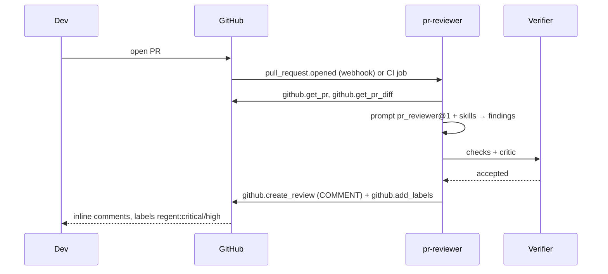
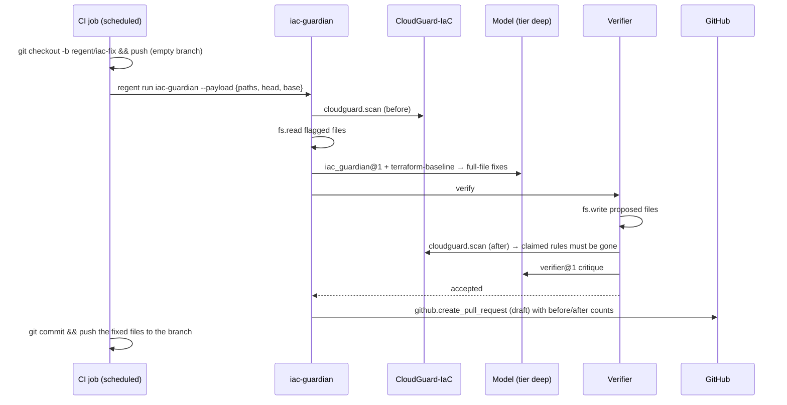

# Workflows

!!! tip "In plain words"
    A workflow is the full story of one kind of event: what starts it, which agent handles it, which tools it uses in which order and why, where a human comes in, and what ends up written down. Six machine workflows are shipped; four human workflows go with them (approving, changing the rules, pulling the emergency brake, updating a prompt).

Every machine workflow follows the same skeleton — **trigger → mandate → analyse (READ tools) → verify → act (tools up to autonomy) → ledger** — so only the differences are described.

## 1. Pull request review



| Step | Tool / component | Why |
|---|---|---|
| Fetch metadata | `github.get_pr` | Title, author, base/head, size — and to refuse bot PRs (routed elsewhere) |
| Fetch the change | `github.get_pr_diff` | The diff is what is reviewed; truncated at 120 k chars with a flag rather than silently |
| Reason | `pr_reviewer@1` + `secure-review` skill | Structured findings, each with file and line; the skill carries the organisation's security lens |
| Check | `findings_cite_lines`, `findings_use_known_enums` | A finding that cannot be placed on the diff is noise or hallucination |
| Critique | `verifier@1` | Overstated severities and "approval-like" phrasing are rejected |
| Post | `github.create_review` event `COMMENT` | The tool cannot approve or request changes: the merge decision is structurally human |
| Label | `github.add_labels` | Makes critical/high findings filterable in the PR list |

**Human touch-points.** Developers reply to dismiss a finding with a reason; dismissed findings feed the eval set. Nobody approves the agent's work: branch protection still needs human reviews.

## 2. CI failure triage

| Step | Tool / component | Why |
|---|---|---|
| Load the run and its jobs | `github.get_workflow_run` | Which jobs and steps failed, which attempt this is |
| Read the tail of the logs | `github.get_job_logs` (last 20 000 chars, ≤ 3 jobs) | Failures are at the end; the whole log would blow the budget and the context |
| Classify | `ci_triage@1` | One of flaky / infrastructure / dependency / code / config / unknown, with quotes |
| Check | `category_known`, `classification_has_quotes`, `rerun_only_when_flaky`, `rerun_at_most_once` | A re-run is only justified by evidence of intermittence, and never loops |
| Act | `github.rerun_failed_jobs` (L3, reversible) · `github.create_issue` · `github.comment` | Flaky → re-run once; real failure → issue with the quotes and a suggested fix; PR → comment |

**Where the mandate matters.** On a repository whose mandate stops at `L1_ADVISE`, the re-run is denied by rule `autonomy`; the agent records the denial in its actions (`rerun_denied`) and still comments. Nothing crashes.

## 3. IaC remediation (CloudGuard → fix → re-scan → draft PR)



| Step | Tool / component | Why |
|---|---|---|
| Scan | `cloudguard.scan` | Deterministic findings with rule ids; only CRITICAL/HIGH are targeted |
| Read | `fs.read` | The model needs the whole file to return a whole file (no partial snippets) |
| Fix | `iac_guardian@1` + `terraform-baseline` | Minimal change, variables instead of guessed values, never a `cloudguard:ignore` without an exception |
| Write + re-scan | `fs.write` (PROPOSE, allowed during verification) then `cloudguard.scan` | **The scanner grades the fix, not the model** — [ADR-0013](adr/ADR-0013-cloudguard-ground-truth.md) |
| Critique | `verifier@1` | Weakened controls and unrelated edits are rejected |
| Propose | `github.create_pull_request` `draft: true` | A human reviews and merges; the agent cannot |

The job then commits the workspace changes to the branch the PR points at. The agent itself never runs `git push`: it is not on the command allow-list.

## 4. Incident triage

| Step | Tool / component | Why |
|---|---|---|
| Receive the alert | `POST /webhooks/alertmanager` (bearer token) | Only firing alerts start a run; labels give repository and environment |
| Recent changes | `github.list_commits` | Most incidents are changes; the prompt is told to prefer that hypothesis |
| Metrics | `metrics.query` (≤ 3 PromQL from the payload) | Evidence for or against each hypothesis |
| Reason | `incident_triage@1` + `incident-communication` | Ranked hypotheses with evidence and a refutation test each; read-only diagnostics; status draft |
| Check | `diagnostics_read_only`, `hypotheses_have_evidence`, `severity_known` | A diagnostic that changes state is refused |
| Post | `github.comment` on the incident issue, or `github.create_issue` | The on-call engineer starts from a list, not a blank page |

**Confidentiality.** The alert payload is wrapped as `RESTRICTED`. With `max_remote_class: INTERNAL` (default) the model call goes to the local provider; with none configured the run fails *before* anything is sent. **Rollback** is a recommendation with its evidence; executing it needs a separate mandate and `exec.kubectl.rollout.undo` (ACT_REVERSIBLE), which no shipped mandate grants.

## 5. Dependency stewardship

| Step | Tool / component | Why |
|---|---|---|
| Identify | `github.get_pr` | Author must be a known bot for a routine decision |
| Read | `github.get_pr_diff` | Versions and lock-file changes |
| Assess | `dependency_steward@1` + `dependency-policy` | `routine` or `review`, with changelog quotes; the bump kind is recomputed in code from the versions |
| Check | `author_is_bot`, `ci_green`, `bump_is_patch_or_minor`, `no_breaking_note` | Policy as code: the model cannot talk its way past a red CI |
| Act | `github.merge_pull_request` (squash) — **requires approval by default** | The default mandate lists it in `requires_approval`; the run ends `awaiting_approval` and labels the PR `needs-approval` |
| Override | `policies/mandates/overrides.example.yaml` scope `acme/internal-tools` | A low-risk repository lifts the approval; more specific scopes win |

## 6. Release notes

| Step | Tool / component | Why |
|---|---|---|
| Compare | `github.compare` base…head | The exact commit list; nothing else is a source |
| Write | `release_scribe@1` + `conventional-commits` | Grouped by type; breaking changes first |
| Check | `notes_not_longer_than_history` | Cannot describe more changes than there were commits |
| Draft | `github.create_release` `draft: true` | A human publishes |

---

## Human workflows

### Approving a pending run

A run ends `awaiting_approval` with `pending_call` (tool and arguments) in the record and the ledger.

=== "Control plane"
    ```bash
    curl -X POST https://regent.internal/runs/<run_id>/approve \
      -H 'content-type: application/json' \
      -d '{"approver": "alice", "tools": ["github.merge_pull_request"]}'
    ```
    The API writes an `approval` event (approver, tools, the pending call) and re-runs the agent with those tools pre-approved. Approving a tool that is not the pending one returns `400`; a run that is not waiting returns `409`.

=== "CI job"
    ```bash
    regent run dependency-steward --repo acme/example \
      --payload '{"number": 42, "ci_green": true}' \
      --approve github.merge_pull_request
    ```
    Put this step behind a GitHub *environment* with required reviewers: the approval is then a GitHub-recorded human action.

Details and rollback in the [runbook](runbooks/approve-a-run.md).

### Changing a mandate

1. Edit `policies/mandates/*.yaml` in a branch.
2. `regent policy-check` locally (also in CI): rejects `L4_ACT`, wildcard allow-lists, unknown tools or agents, budgets over 20 USD per run, agents with no mandate.
3. Open a PR; `CODEOWNERS` routes it to the platform and security teams.
4. Merge; the next run resolves the new mandate and records its `source` file in `run.started`.

### The kill switch

Add `kill_switch: true` to the agent's mandate (any matching document wins) and merge, or set it in an override file mounted at `REGENT_MANDATES_DIR`. Every run for that agent ends `denied` by rule `kill_switch`, recorded in the ledger. [Runbook](runbooks/kill-switch.md).

### Rotating a prompt version

1. Edit `regent/prompts/<name>.md` and bump `version` in the front-matter (`pr_reviewer@1` → `pr_reviewer@2`).
2. Update the eval cases that script that prompt id (`evals/cases/*.yaml`, key `model:`) and add a case for the behaviour that motivated the change.
3. `regent evals` must pass offline; the nightly `--live` run confirms on the real model.
4. From then on the ledger shows the new id and sha256 on every call, so a behaviour change can be dated to the day the prompt changed.
