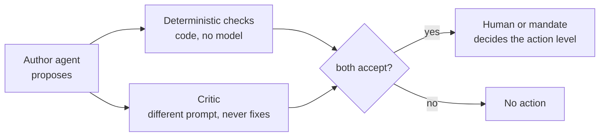

# Governance and autonomy

!!! tip "In plain words"
    "Autonomy" is how much an agent may do on its own. Regent writes it on a ladder with five rungs, from "only look" to "act on your own". Each tool an agent could use sits on the same ladder. An agent may use a tool only if its rung is at least the tool's rung. The rulebook that grants rungs is the **mandate**, a small text file reviewed by humans. This page is the rulebook's grammar.

## The autonomy ladder

| Level | Name | May | May not | Shipped default for |
|---|---|---|---|---|
| L0 | `L0_OBSERVE` | Read and summarise; produce a report | Write anywhere | (first rollout phase of any agent) |
| L1 | `L1_ADVISE` | Write where humans read: PR comments and reviews (COMMENT), issues, labels | Create branches/PRs, merge, run state-changing commands | `pr-reviewer`, `incident-triage` |
| L2 | `L2_PROPOSE` | Prepare a reversible change a human still accepts: write files in the workspace, open a **draft** PR, draft a release | Merge, re-run, roll back | `iac-guardian`, `release-scribe` |
| L3 | `L3_ACT_REVERSIBLE` | Execute reversible changes: re-run failed jobs, merge with a revert path, `kubectl rollout undo`, scale | Anything irreversible | `ci-triage`, `dependency-steward` (merge behind approval) |
| L4 | `L4_ACT` | Irreversible changes (delete, force-push, drop, terminate) | — | **Never granted.** `regent policy-check` rejects any mandate at L4. |

Levels are ordered integers: a mandate at L2 implies L0 and L1.

## Risk classes

Every tool declares one `RiskClass` in code (`ToolSpec.risk`); the policy engine compares it with the mandate's autonomy via `RiskClass.minimum_autonomy`.

| Risk class | Meaning | Examples (exact tool names) |
|---|---|---|
| `READ` (0) | Never changes state | `github.get_pr`, `github.get_pr_diff`, `github.get_job_logs`, `cloudguard.scan`, `fs.read`, `fs.list`, `metrics.query`, `exec.git.status`, `exec.pytest`, `exec.terraform.validate` |
| `ADVISE` (1) | Writes where humans read | `github.comment`, `github.create_review`, `github.add_labels`, `github.create_issue` |
| `PROPOSE` (2) | Creates a change humans must accept | `fs.write`, `github.create_pull_request`, `github.create_release` |
| `ACT_REVERSIBLE` (3) | Changes state with an undo path | `github.rerun_failed_jobs`, `github.merge_pull_request`, `exec.kubectl.rollout.undo` |
| `DESTRUCTIVE` (4) | No undo | *No shipped tool.* The class exists so that adding one is a visible, reviewable decision. |

## The mandate schema

From `regent/core/models.py` (`Mandate`) and the YAML loader in `regent/core/policy.py`.

| Field | Type / default | Meaning |
|---|---|---|
| `agent` | string, required | The agent this document governs |
| `autonomy` | `L0_OBSERVE` … `L3_ACT_REVERSIBLE`, default `L1_ADVISE` | Ceiling for tool risk in the act phase |
| `allowed_tools` | list of globs, default empty | **Allow-list.** A tool not matched is denied (`not_allowed`). Wildcards `*` / `**` are rejected by `policy-check` |
| `denied_tools` | list of globs | Wins over `allowed_tools` (`denied`) |
| `requires_approval` | list of globs | Needs a human even inside the autonomy level (`approval` → `awaiting_approval`) |
| `budget` | object | `max_llm_calls` 20, `max_tool_calls` 50, `max_input_tokens` 400 000, `max_output_tokens` 60 000, `max_usd` 2.0, `max_duration_s` 900 — hard ceilings per run |
| `model_tier` | `fast` \| `balanced` \| `deep`, default `balanced` | Resolved to a model by the router |
| `scopes` | list of repository globs, default `["*"]` | Where the mandate applies |
| `environments` | list of globs, default `["*"]` | `dev`, `staging`, `prod`… |
| `max_remote_class` | `PUBLIC` \| `INTERNAL` \| `CONFIDENTIAL` \| `RESTRICTED`, default `INTERNAL` | Highest data classification allowed to reach a **remote** model |
| `verification` | `required` \| `advisory` \| `none`, default `required` | What a verifier rejection does |
| `skills` | list of skill names | Extra skills on top of the agent's defaults |
| `kill_switch` | boolean | Disables the agent everywhere; any matching document with it set wins |
| `source` | set by the loader | File the mandate came from; written to `run.started` |

**Resolution.** All documents for the agent whose `scopes` and `environments` match are candidates; the most specific (count of non-`*` patterns) wins; ties go to the last loaded file, so `overrides.yaml` beats `defaults.yaml`. A kill switch on any candidate applies.

**Evaluation** (`evaluate`), first rule that fires: `kill_switch` → `denied` → `not_allowed` → `destructive` (needs L4, never granted) → `autonomy` (tool risk above level) → `approval` → `allow`. The rule name goes to the ledger with every decision.

Two runtime layers sit on top of the mandate:

- **Phase gate.** During `analyse` only `READ` tools pass, whatever the mandate says (rule `phase_gate`). During verification `PROPOSE` is opened only for the IaC guardian's re-scan (it writes to the workspace, not to GitHub). During `act` the gate equals the autonomy. [ADR-0011](adr/ADR-0011-phase-gate.md).
- **Pre-approvals.** `--approve <glob>` / the API's `tools` list turn a `require_approval` decision into `allow` with rule `approved`, recorded as such.

## Approval matrix

| Decision | Who | Where it is recorded |
|---|---|---|
| Create or widen a mandate | Platform team + security (CODEOWNERS on `policies/mandates/`) | Git history of the PR; `source` in `run.started` |
| Narrow a mandate or flip the kill switch | Platform on-call alone (no second reviewer needed to *reduce* autonomy) | Same |
| Approve a pending run (`requires_approval` tool) | Repository maintainer named in the GitHub environment / API `approver` | `approval` ledger event; GitHub environment log |
| Merge a draft PR opened by an agent | Normal code owners | GitHub |
| Publish a draft release | Release manager | GitHub |
| Add a tool with a new risk class, or any `DESTRUCTIVE` tool | Architecture review + security; an ADR | Repository |
| Change a prompt or skill | Author + one reviewer; evals must pass | Git; `prompt_id` / skill sha256 in the ledger |

## Separation of duties

Four parties, none of which can both propose and dispose: the author writes the output; the checks test it mechanically; the critic argues against it; the mandate (written by humans) bounds what can follow; for anything in `requires_approval`, a named human approves. The ledger records all four.

## RACI

| Activity | Platform team | Security | Repository owners | Management |
|---|---|---|---|---|
| Run the platform (deploy, on-call, upgrades) | **R/A** | C | I | I |
| Write and review mandates | R | **A** | C | I |
| Write skills (org rules) | C | **R/A** | C | I |
| Prompts and evals | **R/A** | C | I | I |
| Onboard a repository | R | C | **A** | I |
| Approve pending runs | I | I | **R/A** | I |
| Budgets per repository | R | I | C | **A** |
| Review the ledger / audits | R | **A** | I | C |

## Audit trail

Every run writes these event kinds to the ledger (`regent/core/ledger.py`), each hash-chained to the previous one:

| Kind | Data |
|---|---|
| `run.started` | agent, repository, environment, trigger (source, event, actor, payload), mandate summary (autonomy, tier, verification, max_remote_class, source), skills with sha256, dry_run |
| `run.denied` | agent, reason (no mandate) |
| `tool.decision` | call_id, tool, risk, decision, rule, reason, bounded and redacted arguments |
| `tool.call` | call_id, tool, ok, error, classification, bounded and redacted output |
| `llm.call` | prompt_id, provider, model, tier, degraded, classification, redaction kinds, tokens (input/output/cache), usd, stop_reason, refused |
| `llm.error` / `llm.refused` | prompt_id, model, error or refusal |
| `analysis` | the structured output |
| `verification` | mode, accepted, issues, checks, critic_confidence, skipped |
| `approval` | approver, tools, the pending call (API) |
| `run.finished` | status, error, usage, duration_s, pending_call |

Verify with `regent ledger verify <path>`; inspect with `regent ledger show <path> --run <id>`. The file is plain JSON Lines: ship it to the SIEM with the same agent that ships application logs. [Runbook](runbooks/ledger-verification.md).

## Change management

| Artefact | Lives in | Gate | Traceability |
|---|---|---|---|
| Mandates | `policies/mandates/*.yaml` | `regent policy-check` in CI; CODEOWNERS | `source` in `run.started` |
| Prompts | `regent/prompts/*.md` | version bump; evals | `prompt_id` + sha256 on every `llm.call` |
| Skills | `regent/skills/library/*/SKILL.md` or `REGENT_SKILLS_DIR` | version bump; evals | skill id + sha256 in `run.started` |
| Tools | `regent/tools/*.py` | tests; risk class review | `risk` in `tool.decision` |
| Agents | `regent/agents/*.py` | tests + eval case + mandate | agent name everywhere |

## Regulatory mapping

!!! note
    This section maps Regent's mechanisms to the vocabulary of three frameworks so that a compliance reviewer knows where to look. It is not legal advice, and whether a given deployment falls under a given obligation depends on the use case and jurisdiction.

| Framework | Concept | Where Regent provides it |
|---|---|---|
| **EU AI Act** (Regulation 2024/1689) | Transparency — people should know when they interact with AI output | Every comment, review, issue and PR body is signed "🤖 Regent …" and says it is advisory or a draft |
| | Human oversight | Autonomy ladder capped at reversible actions; `requires_approval`; kill switch; humans merge and publish |
| | Record-keeping / logging | Hash-chained ledger with inputs (redacted), decisions, model, cost, approvals |
| | Risk management, data governance | Mandates reviewed by security; `DataClass` and `max_remote_class`; redaction |
| **NIST AI RMF 1.0** | Govern | RACI, change management, CODEOWNERS |
| | Map | Threat model and agent catalogue (purpose, inputs, failure modes) |
| | Measure | Metrics, eval suite, verifier rejection rate |
| | Manage | Budgets, kill switch, runbooks, rollout phases with exit criteria |
| **ISO/IEC 42001** (AI management system) | Controls on AI system lifecycle, logging, impact assessment | The same artefacts; the ADRs document decisions and alternatives |

## Data retention

| Data | Where | Retention (recommended) |
|---|---|---|
| Ledger | file → SIEM/object storage | As long as the organisation's audit policy for change records (often 1–7 years); the hash chain makes long retention meaningful |
| Run records (`RunStore`) | memory now; Postgres in production ([ADR-0009](adr/ADR-0009-run-store.md)) | 90 days online; archive with the ledger |
| Prompts sent to the provider | Provider side | Per the provider's data-retention terms; redaction and classification limit what is there at all |
| Eval fixtures | Repository | Forever (they are code) |
