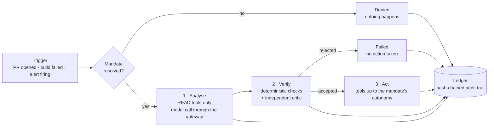

# Regent

**Governed AI agents for DevOps automation. Every action under an explicit mandate.**

Regent is a platform that lets a company put AI agents to work on the boring, risky parts of software delivery — reviewing pull requests, triaging failed builds, fixing insecure infrastructure code, first-responding to incidents, merging routine dependency updates, writing release notes — **without ever letting an agent do something nobody authorised**. Each agent runs under a *mandate* (how autonomous it may be, which tools it may use, how much it may spend, what needs a human), every output is checked by an independent verifier before anything happens, and every step is written to a tamper-evident audit ledger.

!!! tip "In plain words"
    Think of a new junior engineer on their first week. You would not give them the production keys. You would give them a *clear job description*, a *short list of things they are allowed to touch*, a *senior colleague who checks their work*, and you would *keep a record* of what they did. Regent does exactly this — for AI agents. The job description is the **mandate**, the senior colleague is the **verifier**, the record is the **ledger**.

## The 60-second mental model

| Word | Meaning | Where it lives |
|---|---|---|
| **Agent** | One bounded automation (e.g. *review a pull request*). It reasons with a language model and acts through tools. | `regent/agents/` |
| **Tool** | The only way an agent touches the world (read a diff, post a comment, open a PR). Every tool declares a **risk class**. | `regent/tools/` |
| **Mandate** | The contract an agent runs under: autonomy level, tool allow-list, budget, approvals, data confidentiality ceiling. Nothing runs without one. | `policies/mandates/*.yaml` |
| **Run** | One execution of one agent under one mandate, in three phases: **analyse → verify → act**. | `regent/runtime/` |
| **Verifier** | An independent critic (deterministic checks + a second model call with a different prompt) that accepts or rejects the output *before* any action. | `regent/agents/verifier.py` |
| **Ledger** | Append-only, hash-chained JSON Lines file. Removing, reordering or editing a line breaks the chain. | `regent/core/ledger.py` |
| **Gateway** | The single door to language models: secrets are redacted, confidential data is kept on local models, the model is chosen by *tier*, the budget is charged. | `regent/gateway/` |

## What the repository proves

- **117 automated tests** run offline, with no API key and no network: the model is replaced by a *replay provider* that answers from fixtures, and GitHub by a fake client. Safety properties are tests, not promises: *a tool outside the allow-list is denied*, *a rejected verification blocks the action*, *a write during the analysis phase is refused*, *a tampered ledger is detected*.
- **6 evaluation cases** (`evals/cases/`) treat prompts like code: change a prompt, and the eval suite says whether the agent still behaves.
- **Real CloudGuard-IaC integration**: the IaC guardian agent's proposed fix is re-scanned by the scanner before a pull request is opened — the model does not get to grade its own homework.
- **Supply-chain attestations** on the released container image (SBOM, SLSA provenance, keyless signature), documented in [Certifications and attestations](12-certifications-and-attestations.md).

## Reading guide

=== "I know nothing about DevOps or AI"
    1. [Guided tour](00-guided-tour.md) — follow one pull request through the whole system.
    2. [Vision and business case](01-vision-and-business-case.md) — why this exists.
    3. [Glossary](glossary.md) — keep it open in a tab.
    4. [Operating model](10-operating-model.md) — who does what, and how a company would roll it out.

=== "I am an architect or tech lead"
    1. [Architecture](02-architecture.md) — C4 diagrams, modules, data flows, failure modes.
    2. [Decisions (ADR)](adr/README.md) — the sixteen decisions and their alternatives.
    3. [Technology radar](11-technology-radar.md) — chosen vs rejected, per layer.
    4. [Agent catalogue](03-agent-catalogue.md) and [Workflows](04-workflows.md).
    5. [Observability and evals](07-observability-and-evals.md), [FinOps](08-finops.md), [Platform and delivery](09-platform-and-delivery.md).

=== "I am a security reviewer or auditor"
    1. [Governance and autonomy](05-governance-and-autonomy.md) — the autonomy ladder, the mandate schema, separation of duties, the audit trail.
    2. [Security](06-security.md) — threat model, OWASP LLM Top 10 mapping with the code that mitigates each item, supply chain.
    3. [Certifications and attestations](12-certifications-and-attestations.md) — verify the artefacts yourself.
    4. [Runbooks](runbooks/README.md) — kill switch, ledger verification, credential rotation.

## Where Regent comes from

Regent builds on two earlier projects by the same author:

- **[CloudGuard-IaC](https://github.com/FlorianMartins/cloudguard-iac)** — a shift-left security scanner for Terraform and Dockerfiles. Regent uses it as a tool (`cloudguard.scan`) and, more importantly, as *ground truth*: a security fix proposed by a model only counts when the scanner agrees.
- **[LLM Security Lab](https://github.com/FlorianMartins/hivey-llm-security-lab)** — a deliberately vulnerable AI assistant and its hardened twin, with a red-team suite covering the OWASP Top 10 for LLM applications. Its lessons (never concatenate untrusted data into instructions; never put secrets in a model's context; cap consumption) are baked into Regent's gateway and prompts.
